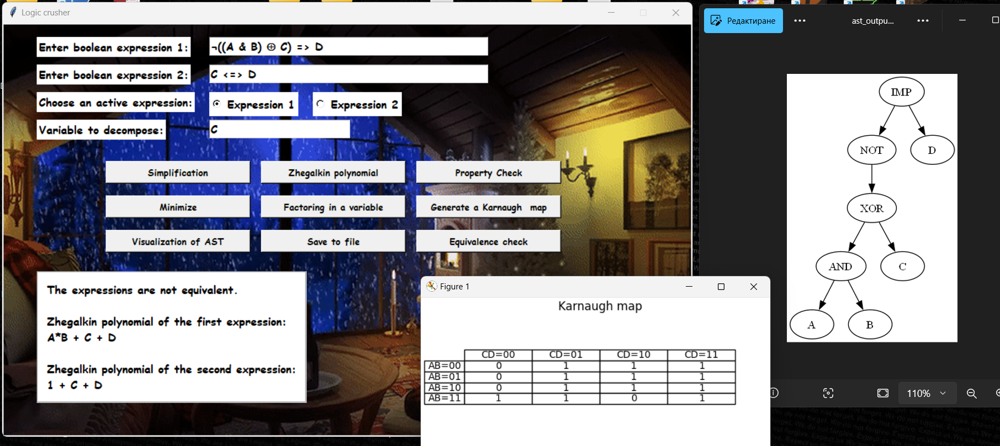

# **Logic crusher**

## **Description:**

Logic Crusher is a graphical application that allows users to type, 
simplify and minimize Boolean expressions. The application uses the Quine–McCluskey algorithm to 
minification and rendering visualization through carno maps and Abstract Syntax Tree (AST). The main goal is to reduce the complexity of logic formulas for better comprehensibility and efficiency, and to facilitate the analysis and optimization of logical expressions for educational and professional purposes.

## **Supported operators:**

| Binary logical operators | Supported alternatives |
|----------|----------|
| Disjunction | OR, or, ∨, \|, \|\| |
| Conjunction |  AND, and, &, ∧, && |
| Exclusive or |  XOR, xor, ^, ⊕ |
| Equivalence | EQV, eqv, <=>, ↔, ==|
| Implication | IMP, imp, =>, →, ⇒|
| Not AND | NAND, nand, !&, ¬&, ↑ |
| Not OR | NOR, nor, !v, ¬∨, ↓ |

| Unary logical operators  | Supported alternatives |
|----------|----------|
| Negation | NOT, not, !, ~, ¬ |

| Constants  | Supported alternatives |
|----------|----------|
| True | true, 1 |
| False | false, 0 |

## **Functionalities:**

* Entering one or two Boolean expressions through the user interface, with an option to set the status to "active", prioritizing one of the two to perform subsequent functionality.
* Expression syntax validation.
* Simplify the expression.
* Checking logical properties: monotonicity, linearity, self-duality, preservation of zero and one.
* Minimizing Boolean expressions with the Quine–McCluskey algorithm.
* Generating a Zhegalkin polynomial.
* Generate and visualize Carnot maps for 2 to 4 variables.
* Abstract Syntax Tree (AST) Visualization with Graphviz.
* Display results and minimized expressions in the GUI.
* Factoring in a variable.
* Option to save a specific expression as a file.
* Checking for equality between two Boolean expressions.

   

   

## **Rules:**

* Enter Boolean Expressions: Variables should consist of letters (a-z, A-Z), do not use reserved keywords like true, false as variable names. Expressions are evaluated from left to right if no parentheses are included to separate precedence. The user should be familiar with how logical operators work in advance.
* Choose Active Expression: Ensure the selected expression is entered correctly before proceeding.
* Variable to Decompose: Enter a valid variable name present in the active expression. Case-sensitive (e.g., A is different from a).
* Factoring in a Variable: Specify a valid variable in the "Variable to Decompose" field.
* Generate a Karnaugh Map: The expression must contain 2 to 4 variables.
* Save to File: Saves all stored Boolean functions and their properties to a JSON file.
* Equivalence Check: Both Expression 1 and Expression 2 must be valid Boolean expressions.
