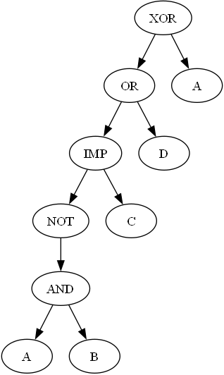

# **Logic Crusher**

## **Description**

Logic Crusher is a graphical application that allows users to type, simplify, and minimize Boolean expressions. The application uses the Quine–McCluskey algorithm for minimization and offers visual tools like Karnaugh maps and Abstract Syntax Tree (AST) rendering. 

The goal is to simplify logical formulas for better comprehension and efficiency, making the tool useful for both educational and professional purposes.

---

## **Supported Operators**

| Binary Logical Operators | Supported Alternatives |
|---------------------------|------------------------|
| Disjunction              | OR, or, ∨, \|, \|\|    |
| Conjunction              | AND, and, &, ∧, &&     |
| Exclusive OR             | XOR, xor, ^, ⊕         |
| Equivalence              | EQV, eqv, <=>, ↔, ==   |
| Implication              | IMP, imp, =>, →, ⇒     |
| Not AND                  | NAND, nand, !&, ¬&, ↑  |
| Not OR                   | NOR, nor, !v, ¬∨, ↓    |

| Unary Logical Operators | Supported Alternatives |
|--------------------------|------------------------|
| Negation                | NOT, not, !, ~, ¬      |

| Constants  | Supported Alternatives |
|------------|-------------------------|
| True       | true, 1                 |
| False      | false, 0                |

---

## **Functionalities**

- Enter and prioritize one or two Boolean expressions for further operations.
- Validate the syntax of Boolean expressions.
- Simplify expressions to their most concise form.
- Check logical properties:
  - Monotonicity
  - Linearity
  - Self-duality
  - Preservation of zero
  - Preservation of one
- Minimize expressions using the Quine–McCluskey algorithm.
- Generate Zhegalkin polynomials.
- Visualize Karnaugh maps (2–4 variables).
- Render Abstract Syntax Trees (AST) using Graphviz.
- Save expressions and properties to JSON files.
- Check equivalence between two Boolean expressions.

---
  

    

  
  

    
   

  

---

## **Rules**

- Enter Boolean Expressions:
   - Variables must consist of letters (a-z, A-Z).
   - Reserved keywords (`true`, `false`) cannot be used as variable names.
   - Expressions without parentheses are evaluated left-to-right based on operator precedence.
- Choose Active Expression: Select which expression (1 or 2) to use for operations.
- Variable to Decompose: Specify a variable from the active expression. Case-sensitive (e.g., `A` ≠ `a`).
- Factoring in a Variable: Decomposes the active expression with respect to the specified variable.
- Generate a Karnaugh Map: Only supported for 2–4 variables.
- Save to File: Saves all stored expressions and properties as a JSON file. 
- Equivalence Check: Both expressions must be valid and entered in their respective fields.
