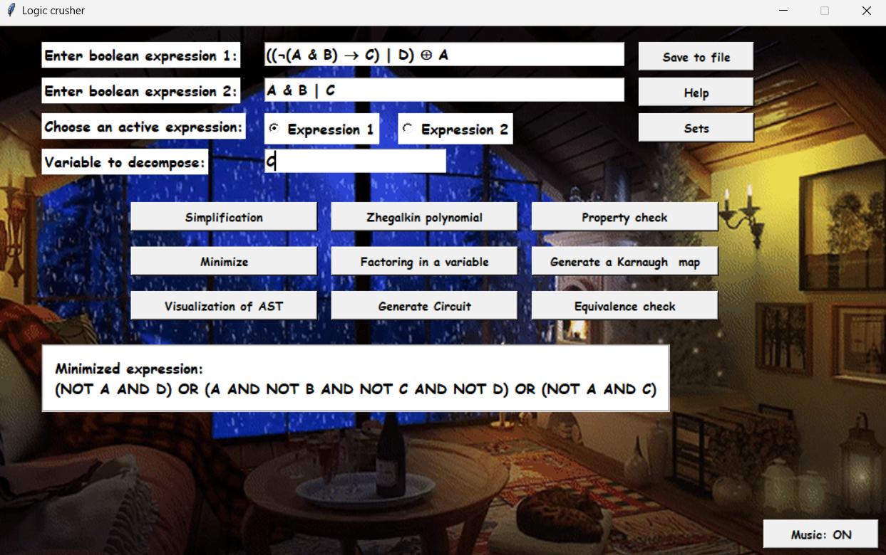
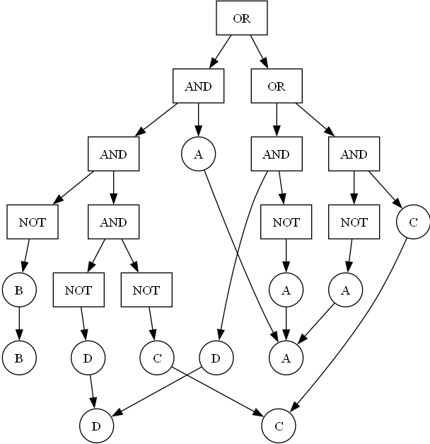
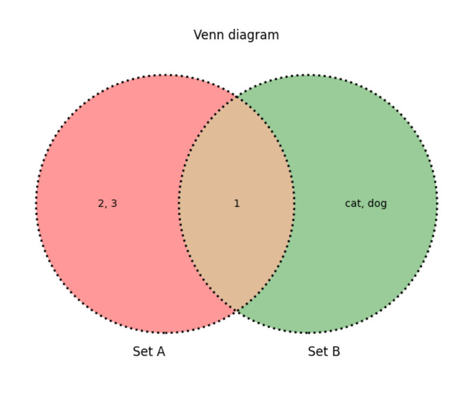

# **Logic Crusher**

## **Описание**

**Logic Crusher** е графично приложение, което позволява на потребителите да въвеждат, опростяват и минимизират Булеви изрази. Приложението използва алгоритъма на Quine–McCluskey за минимизация и предлага визуални инструменти като Карно карти и визуализация на Абстрактно Синтактично Дърво (AST).

Целта е да се опрости логическите формули за по-добро разбиране и ефективност, като инструментът е полезен както за образователни, така и за професионални цели.

---

## **Поддържани Оператори**

### **Двоични Логически Оператори**

| Оператор                   | Поддържани Алтернативи       |
|----------------------------|------------------------------|
| Дизюнкция (OR)             | OR, or, ∨, \|, \|\|          |
| Конюнкция (AND)            | AND, and, &, ∧, &&           |
| Изключващо ИЛИ (XOR)       | XOR, xor, ^, ⊕              |
| Еквивалентност (EQV)       | EQV, eqv, <=>, ↔, ==         |
| Импликация (IMP)           | IMP, imp, =>, →, ⇒           |
| НЕ И (NAND)                | NAND, nand, !&, ¬&, ↑        |
| НЕ ИЛИ (NOR)               | NOR, nor, !v, ¬∨, ↓         |

### **Унарни Логически Оператори**

| Оператор   | Поддържани Алтернативи |
|------------|------------------------|
| Отрицание (NOT) | NOT, not, !, ~, ¬ |

### **Константи**

| Константа | Поддържани Алтернативи |
|-----------|-------------------------|
| True      | true, 1                 |
| False     | false, 0                |

---

## **Функционалности**

- **Въвеждане и приоритизиране на Булеви изрази:**
  - Въвеждайте и изберете един или два Булеви израза за по-нататъшни операции.
  
- **Валидиране на синтаксис:**
  - Проверява правилността на синтаксиса на въведените Булеви изрази.
  
- **Опростяване на изрази:**
  - Опростява изразите до най-кратката им форма.
  
- **Проверка на логически свойства:**
  - **Монотонност:** Проверява дали функцията е монотонна.
  - **Линейност:** Проверява дали функцията е линейна.
  - **Самодуелност:** Проверява дали функцията е самодуелна.
  - **Запазване на нула:** Проверява дали функцията запазва нула.
  - **Запазване на единица:** Проверява дали функцията запазва единица.
  
- **Минимизиране на изрази:**
  - Минимизира изразите с помощта на алгоритъма на Quine–McCluskey.
  
- **Генериране на полином на Жегалкин:**
  - Генерира полиномите на Жегалкин за избраните Булеви изрази.
  
- **Визуализация на Карно карти:**
  - Генерира и визуализира Карно карти за Булеви функции с 2-4 променливи.
  
- **Визуализация на Абстрактно Синтактично Дърво (AST):**
  - Визуализира AST на избраните Булеви изрази с помощта на Graphviz.
  
- **Генериране на логическа схема (Circuit Diagram):**
  - Генерира и визуализира логически схеми на минимизираните изрази.
  
- **Запазване на изрази и свойства:**
  - Запазва всички съхранени изрази и техните свойства във файлове във формат JSON.
  
- **Проверка на еквивалентност между два израза:**
  - Проверява дали два Булеви израза са еквивалентни и показва разликите в броя на входните комбинации.

- **Операции със множества:**
  - **Обединение (Union):** Обединява два множества.
  - **Пресичане (Intersection):** Намира общите елементи между два множества.
  - **Разлика (Difference):** Намира елементите, които са в едно множество, но не и в другото.
  - **Симетрична разлика (Symmetric Difference):** Намира елементите, които са в едно от двете множества, но не в двете.
  - **Вен диаграми:** Визуализира Вен диаграми за две множества.
  - **Декартово произведение (Cartesian Product):** Изчислява декартовото произведение на две множества.
  - **Кардиналност:** Изчислява броя на елементите в двете множества.
  - **Подмножества (Power Sets):** Генерира подмножествата на двете множества.
  - **Проверка на отношения:** Проверява различни отношения между множествата като подмножество, супермножество, равенство и дискретност.

---

## **Правила**

- **Въвеждане на Булеви Изрази:**
  - Променливите трябва да се състоят от букви (a-z, A-Z).
  - Резервираните ключови думи (`true`, `false`) не могат да се използват като имена на променливи.
  - Изразите без скоби се оценяват отляво надясно според приоритета на операторите.
  - Изразите трябва да са коректно синтактично оформени със скоби при необходимост.
  - Използвайте поддържаните логически оператори и константи.

- **Въвеждане на Множества:**
  - Въвеждайте елементите на множествата, разделени със запетайки (например A, B, C).
  - Използвайте алтернативните наименования за операциите според нуждите ви.

- **Избор на Активен Израз:**
  - Изберете кой израз (1 или 2) да се използва за операции.

- **Променлива за Декомпозиция:**
  - Специфицирайте променлива от активния израз за декомпозиция. Чувствителна към големи и малки букви (напр. `A` ≠ `a`).

- **Факторизиране по Променлива:**
  - Декомпозира активния израз спрямо зададената променлива.

- **Генериране на Карно Карта:**
  - Поддържа се само за Булеви функции с 2-4 променливи.

- **Запазване във Файл:**
  - Запазва всички съхранени изрази и техните свойства като JSON файл.

- **Проверка на Еквивалентност:**
  - И двата израза трябва да са валидни и въведени в съответните полета.

---

  

    

  
  

    

  
  

    

  
  

    

  
  

    

  

---
