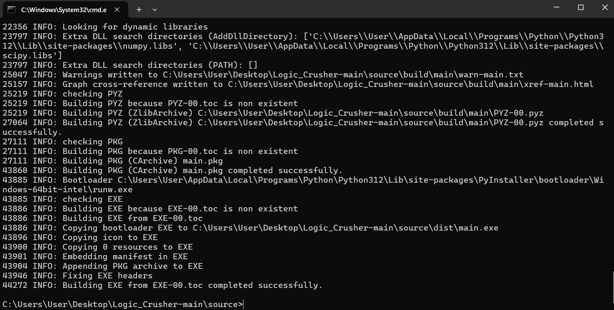
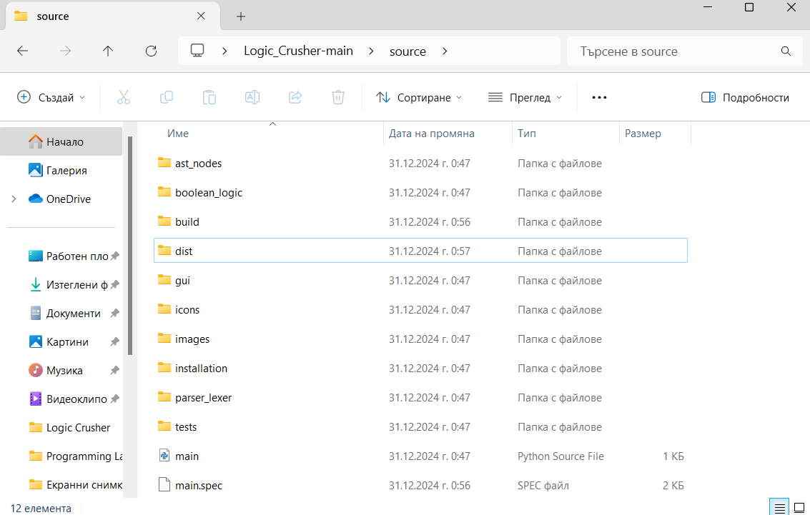
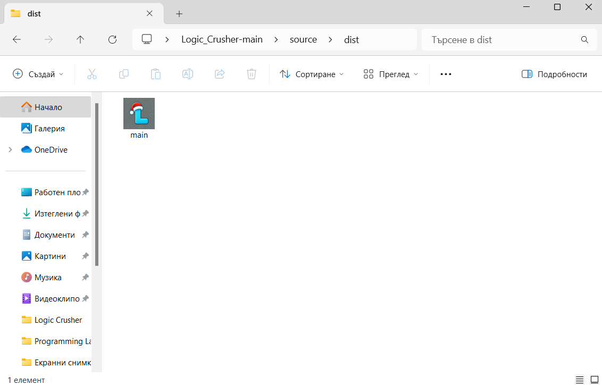

## **How to install Logic Crusher?**
1. **Download the contents from the specific `repository`.**
2. **Open the `source` folder, then start a command prompt in this directory.**

  

    

  
  

    

  
  

    

  

3. **Copy and paste the command from `command.txt` into the command prompt.**
    - **Note:** the command in `command.txt` is an example. You need to manually update the path to the source folder so that it corresponds to its actual location on your computer.

4. **Wait for `PyInstaller` to finish. If everything went smoothly, the folders `build`, `dist`, and the file `main.spec` should appear. The application's executable file can be found in the `dist` folder.**
- **Notes:**
    - The application icon is an `.ico file` which is a combination of images with dimensions `256x256`, `128x128`, `64x64`, `32x32`, and `16x16` pixels. In some cases (especially if the operating system or file manager does not recognize these sizes), the image might not be displayed correctly.
    - The first time you use `Visualisation of AST` or `Generate Circuit`, additional files are created in the source folder, storing information about the last recalculated Boolean expression. On every subsequent use, these files are overwritten.
  

    

  
  

    

  
  

    

  
