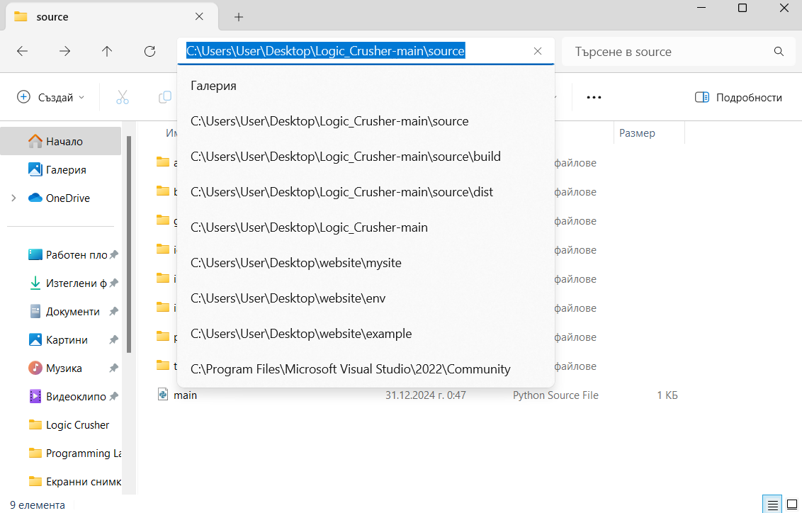

## **Как да инсталираме Logic Crusher?**
1. **Сваляме съдържанието от конкретното `repository`.**
2. **Отваряме папката `source`, след което стартираме команден прозорец в тази директория.**

  

    

  
  

    

  
  

    

  

3. **Копираме и поставяме командата от `command.txt` в командния прозорец.**
    - **Забележка:** командата в `command.txt` е примерна, спрямо конкретизирана директория на цялата папка с всички файлове, тоест пътят до             папката `source`, трябва да бъде актуализиран ръчно от потребителя спрямо местоположението й.

4. **След известно време на командния прозорец трябва изпише следното, ако всичко е протекло нормално. Появяват се `build`, `dist` i `main.spec`, като приложението се намира в `dist`.**
- **Забележка:**
    - Изображението на приложението представлява един `ico` файл, който пък от своя страна е комбинация от `256х256`, `128х128`, `64х64`, `32х32`, и `16х16`              пикселни изображения, тоест не поддържа абсолютно всеки "`zoom`" и е възможно в дадени случаи изображението да не бъде генерирано.
    - При първо използване на `Visualisation of AST` или `Generate Circuit` се създават файлове в `source`, които пазят информация за последното им преизчисляване         на даден булев израз, като при всяко тяхно използване отново те се презаписват. Аналогично при използване на проложението от кода.
  

    

  
  

    

  
  

    

  

    
