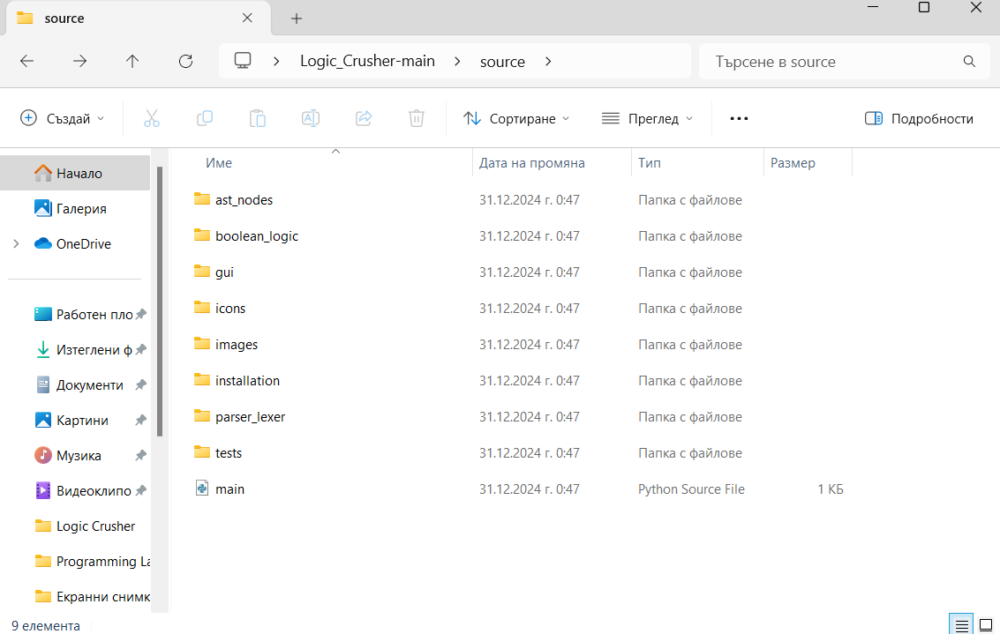

## **Как да инсталираме Logic Crusher?**
1. **Сваляме съдържанието от конкретното `repository`.**
2. **Отваряме папката `source`, след което стартираме команден прозорец в тази директория.**

  

    

  
  

    

  
  

    

  

3. **Копираме и поставяме командата от `command.txt`.**
    - **Забележка:** командата в `command.txt` е примерна, спрямо конкретизирана директория на цялата папка с всички файлове, тоест пътят до             папката `source`, трябва да бъде актуализиран ръчно от потребителя спрямо местоположението й.
